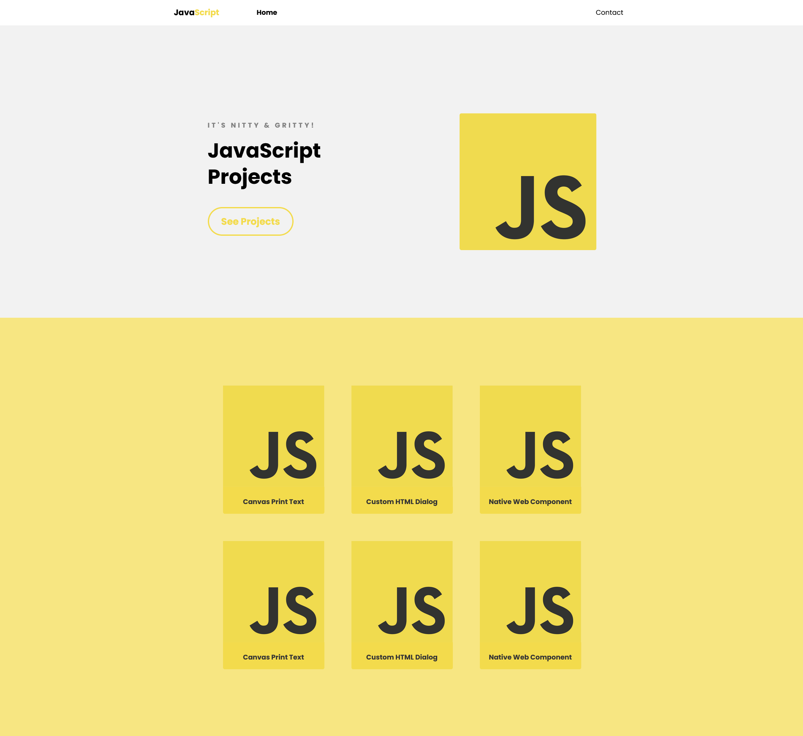

# JavaScript Simple Applications

This project is a site showing simple applications/projects built with **JavaScript**,
this project only contains JavaScript on client side aka **Frontend**.
List of simple JavaScript projects on server side is in this link
[nodejs-simple-applications](https://github.com/study-hary-id/nodejs-simple-applications),
check out this repository :thumbsup:.

## :memo: Features

- Implement mobile first design
- Support viewport from 280px
- Common web components

## :camera: Screenshots

Note: _Ignore the screenshot because this project isn't completely done._ :sweat_smile:

## :handshake: Contributing

Pull requests are welcome. For major changes, please open an issue first to discuss
what you would like to change.

## :writing_hand: Credits

The idea was from this channel [DesignCourse](https://www.youtube.com/c/DesignCourse/)
and [John Smilga](https://www.vanillajavascriptprojects.com/)

Copyright :copyright: 2022. This project is under [CC0](LICENSE) licensed.
